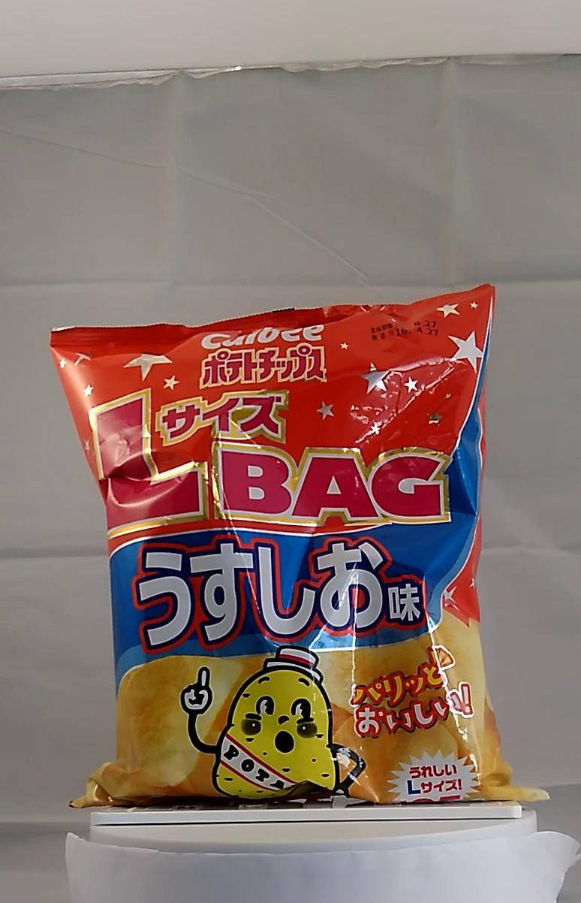
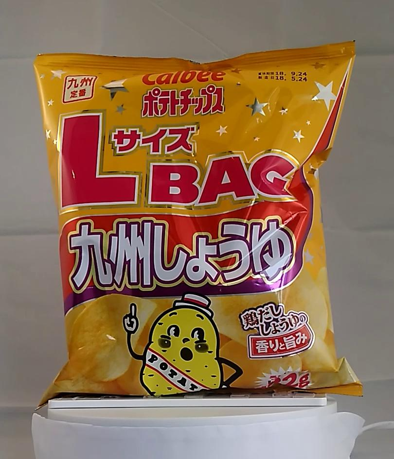
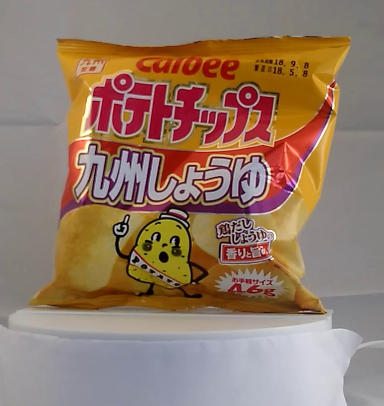

DLLab Day 2018 ハッカソン CV編
==============================

## 問題

与えられたデータセットを用いて9クラス分類を行うネットワークを訓練してください。

### 注意

- ネットワークの訓練には必ず学習用データセットのみを用いてください。
- 学習中、検証用データセットを用いて評価を行い、ハイパーパラメータの調整等を行うことは可能です。
- テストデータセットは、全ての学習プロセスが終了したあとに、できあがったモデルを使って精度の評価をするためだけに用いてください。

## データセット

データセットは以下のコマンドでダウンロードできます。（うまくいかない場合は、[こちら](https://1drv.ms/u/s!Ag0C-0x1VRpvg2czus7P57YFKP0x)からダウンロードしてください。）

```bash
curl -L "https://rebrand.ly/dllab2018-hackathon-cv" -o data.tar.gz
```

ダウンロードしたファイルを解凍すると、`data` というフォルダに以下のようにファイルが入っています。

```
data
|
|-- train
|   |
|   |-- images
|   |   |-- 4901330502911_11_D30_000.jpg
|   |   |-- 4901330502911_11_D30_015.jpg
|   |   |-- 4901330502911_11_D30_030.jpg
|   |   |-- ...
|   |   `-- ...
|   |
|   `-- train_labels.txt
|
|-- valid
|   |
|   |-- images
|   |   |-- 4901330502911_10_D30_120.jpg
|   |   |-- 4901330502911_10_D30_180.jpg
|   |   |-- 4901330502911_10_D30_240.jpg
|   |   |-- ...
|   |   `-- ...
|   |
|   `-- valid_labels.txt
|
`-- test
    |
    |-- images
    |   |-- 4901330502911_10_D30_000.jpg
    |   |-- 4901330502911_10_D30_015.jpg
    |   |-- 4901330502911_10_D30_030.jpg
    |   |-- ...
    |   `-- ...
    |
    `-- test_labels.txt
```

- `data` 以下には学習用（`train`）、検証用（`valid`）、評価用（`test`）と用途別にデータを分けるための3つのディレクトリが存在しています。
- `train` ディレクトリ以下には `images` というディレクトリと `train_labels.txt` というテキストファイルが設置されています。
    - `train_labels.txt` の中身は、各行が学習用画像のファイル名と、対応するクラスのIDが、スペースで区切られたものになっています。
    - `images` ディレクトリには、`train_labels.txt` に羅列されたのと同じファイル名の画像データが入っています。
- `valid` および `test` ディレクトリについても中身は同様となります。

画像のサンプルは以下のようになっています。

| Class ID | Sample image                                                            |
| :------- | :---------------------------------------------------------------------: |
| 0        |  |
| 1        |  |
| 2        |  |
| 3        |  |
| 4        |  |
| 5        |  |
| 6        |  |
| 7        |  |
| 8        |  |
